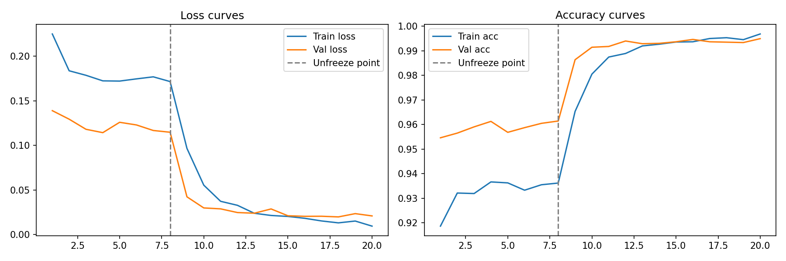

# Greece Wildfire Analysis Agent

An autonomous agent for wildfire incident analysis over Greek satellite imagery, running entirely on local open-source LLM inference with no API costs.

Greece lost more than 81,000 hectares to wildfire in 2023 alone, anchored by the Evros (Dadia) fire — the largest single fire ever recorded in European Union history (Copernicus EMS EMSR686; EFFIS). This project builds an LLM agent that orchestrates satellite imagery retrieval, dNBR burn-scar segmentation, NASA FIRMS thermal cross-validation, Open-Meteo weather correlation, and RAG-based historical comparison to produce structured incident reports on demand. The agent runs entirely on Qwen 2.5 7B via Ollama and was evaluated over 20 runs across four open-ended scenarios, achieving 87% tool-orchestration accuracy (52/60) and 81% report quality (69/85) with zero API spend.

---

## Results

| Metric | Result | Notes |
|---|---|---|
| MUST pass rate | 20/20 (100%) | Structural completion |
| SHOULD pass rate | 52/60 (87%) | Tool-orchestration accuracy |
| Report quality | 69/85 (81%) | Synthesis correctness |
| Eval scenarios | 4 cases × 5 runs | Qwen 2.5 7B, temp=0.2 |
| API cost | $0 | Fully local inference |
| Hardware | Consumer laptop GPU, ~5 GB VRAM | RTX 4080 Laptop |

---

## Demo

*Demo screenshot: [insert ui_demo.png]*

**No LLM API key required.** All inference runs locally on Ollama.

---

## Model training

The burn-scar segmentation model was fine-tuned on Sentinel-2 imagery from the 2023 Greek fire season.



---

## Architecture

The system has four layers: an EfficientNet-B0 classifier and dNBR segmentation model (ML layer), a tool layer wrapping five external data sources and the local checkpoint, a Qwen 2.5 7B agent loop via Ollama that decides which tools to call and in what order, and a Gradio streaming UI that surfaces the tool-call trace and final report side-by-side. Each user query enters the agent loop; the model emits tool calls, receives structured JSON results, and iterates until it produces a markdown report or exhausts the turn budget (MAX_TURNS=10).

```
User query
     │
     ▼
 Agent loop (Qwen 2.5 7B, Ollama, temp=0.2)
     │
     ├── fetch_satellite_imagery   → Google Earth Engine (Sentinel-2 GeoTIFFs)
     ├── run_burn_scar_model       → EfficientNet-B0 checkpoint + dNBR mask
     ├── query_firms_active_fires  → NASA FIRMS VIIRS_SNPP_SP archive API
     ├── query_weather_conditions  → Open-Meteo historical archive API
     └── lookup_historical_context → RAG (all-MiniLM-L6-v2, 15 source docs)
     │
     ▼
  Markdown incident report
```

---

## Findings

These are the four most instructive results from the evaluation. The full trace data, per-run breakdowns, and failure flags are in `wildfire_agent/eval_runs/eval_summary.json`.

### Open-source orchestration is viable but not transparent

Qwen 2.5 7B completed the structural workflow in all 20 runs (100% MUST pass rate). On the most demanding scenario — *"How bad was the Evros wildfire in August 2023?"* — the model called all five tools in logical sequence (RAG first to retrieve the ignition date, then imagery, burn scar, FIRMS, weather) in all five runs, averaging 6 LLM turns and 93 seconds end-to-end. Tool selection degraded on under-specified queries: the comparative historical scenario had a SHOULD coverage of 12/20, because the model satisfied itself with RAG and weather data and did not infer that quantitative comparison required satellite analysis. The pattern is consistent: the model dispatches tools when the query signals them directly, and struggles when it must infer what to call from open-ended phrasing.

### The dominant failure mode is synthesis, not tool selection

On the comparative query, the model called the right tools — including `query_weather_conditions` for two different fires in one run to construct a side-by-side table — but failed to articulate the comparison in language (comparison_made predicate: 1/5 runs). It retrieved comparable weather values for Evros and Rhodes, presented them in parallel, and concluded conditions were "severe," without using any explicit comparison framing. This is consistent with known limitations of 7B-scale models on multi-document synthesis: the capacity to acquire comparable facts exists; the capacity to express the inference does not always follow. Larger open-weight models may close this gap, though this was not tested.

### Hallucination under pressure to fill structure

In one run on the comparative query, the model fabricated weather data for the 2018 Mati fire to complete a comparison table. The values presented (36.5°C, 10.0 km/h, 48% humidity, HDWI 2.5) were never returned by any tool call — the only weather call in that run fetched Rhodes data. The Rhodes row in the same table was accurate. This is the most important failure mode the evaluation surfaced: when prompted to produce structured output with a defined shape, a small model will invent values to fill the structure rather than acknowledge a gap. The run is flagged in `eval_runs/eval_summary.json` with `report_quality_notes: ["hallucinated_weather_data_for_mati_2018"]`. Any operational use of this system would require tool-result provenance checks before the report is surfaced to a user.

### Tool design matters as much as model choice

Three of the original 20 runs crashed with `TypeError: run_burn_scar_model() got an unexpected keyword argument 'fire_start_date'`. The model correctly inferred the ignition date from a prior `lookup_historical_context` result and carried it forward as context — a defensible behavior — but passed it as a keyword argument to a tool that did not declare it. Adding `**_` to every tool function signature and a `TypeError`-catching fallback block in `dispatch_tool` brought MUST to 100% without changing the model or system prompt. Most agent project implementations skip this defensive layer entirely; the eval revealed the exact scenario where the omission causes a silent run failure.

---

## Stack

- **Burn-scar segmentation**: PyTorch + EfficientNet-B0 (fine-tuned on Sentinel-2 RGB), dNBR computed from pre/post NIR imagery via rasterio
- **Satellite imagery**: Sentinel-2 multispectral GeoTIFFs via Google Earth Engine, cached locally per region
- **Fire detections**: NASA FIRMS VIIRS_SNPP_SP archive API, internally chunked into 5-day calls and deduplicated by (lat, lon, date)
- **Weather data**: Open-Meteo historical archive API (free, no key required)
- **RAG**: sentence-transformers (all-MiniLM-L6-v2), cosine similarity over numpy, 15 sourced markdown documents covering Greek and Mediterranean fires 2007–2024
- **Agent loop**: Ollama 0.24.0, Qwen 2.5 7B (4.7 GB), temperature 0.2, 8,192-token context window
- **UI**: Gradio, streaming tool-call trace plus final report, port 7861

---

## Repo layout

```
wildfire/
├── wildfire_agent/
│   ├── agent.py               # Ollama agent loop
│   ├── tools.py               # Tool implementations and dispatch
│   ├── ui.py                  # Gradio streaming UI (port 7861)
│   ├── eval_dispatch.py       # Tool-dispatch regression eval (6 cases)
│   ├── eval_orchestration.py  # Orchestration quality eval (4 cases)
│   ├── eval_runs/             # Saved traces, rerun JSON, eval_summary.json
│   └── rag/
│       ├── docs/              # 15 sourced markdown documents
│       ├── build_index.py     # Embed docs → index.npz + docs.json
│       ├── index.npz          # Prebuilt embedding index (15 × 384 float32)
│       └── docs.json
├── data/sentinel2/            # Cached Sentinel-2 GeoTIFFs (by region)
├── outputs/                   # Burn-scar mask PNGs
├── model.py                   # WildfireDetector (EfficientNet-B0 wrapper)
├── best_model_sentinel.pt     # Trained checkpoint
└── download_sentinel2_greece.py
```

---

## Run it yourself

1. `git clone <repo-url> && cd wildfire`
2. `conda env create -f environment.yml && conda activate wildfire`
3. Create `.env` with two keys: `GEE_PROJECT=<your-gee-project>` and `FIRMS_API_KEY=<key>`. No LLM API key is required.
4. `ollama pull qwen2.5:7b`
5. `python download_sentinel2_greece.py` — downloads and caches Sentinel-2 GeoTIFFs for all five regions (~500 MB)
6. `python -m wildfire_agent.rag.build_index` — embeds the 15 RAG documents, writes `rag/index.npz` and `rag/docs.json`
7. `python -m wildfire_agent.ui` — starts the Gradio interface at `http://localhost:7861`

To run the evals independently: `python -m wildfire_agent.eval_dispatch` (tool regression, ~30 min) and `python -m wildfire_agent.eval_orchestration` (orchestration quality, ~30 min on laptop GPU).

---

## Limitations

- **Regional scope**: five Greek regions (Evros, Rhodes, Attica, Evia, Peloponnese). Adding a new region requires a GEE imagery download and a one-line entry in the `REGIONS` dict in `tools.py`.
- **dNBR calibration**: USGS dNBR thresholds (0.10 / 0.27 / 0.44) are appropriate for Mediterranean shrub and forest. They may produce inaccurate burn-area estimates in different vegetation types.
- **FIRMS window cap**: the FIRMS API is queried in 5-day chunks up to a 30-day window. Fires burning longer than 30 days will have their detection count undercounted.
- **RAG corpus size**: the index covers 15 documents, all Greek or Mediterranean fire events. Similarity scores degrade on queries outside this domain.
- **Model scale**: synthesis quality is bounded by the 7B parameter count. The hallucination risk in §Findings is a known property of smaller models and would likely decrease on 13B+ models, at higher VRAM cost.
- **Thermal constraints during eval**: sustained inference on the RTX 4080 Laptop triggered the thermal pause threshold (80°C) during back-to-back runs, adding 60-second cooling delays. Server-class hardware would remove this constraint.
- **Operational use**: outputs have not been validated against verified ground-truth fire perimeters. Reports should be treated as a structured starting point for analyst review, not as authoritative assessments.

---

## What this project is and isn't

This is a working demonstration of LLM agent orchestration over a real ML pipeline — live satellite segmentation, external API calls, and a sourced RAG corpus — with a two-tier evaluation framework and named failure modes documented at the run level. It is not a production fire-monitoring system, a replacement for trained fire analysts, or a general benchmark of Qwen 2.5 7B. The 81% report quality figure reflects real synthesis gaps, not an optimistic ceiling: the evaluation predicates were written after observing model behavior and calibrated to avoid trivial passes. The failure modes documented here — synthesis gaps on comparison queries, hallucination under structural pressure, kwarg tolerance in tool dispatch — are the honest result of measuring the system rather than describing it.
